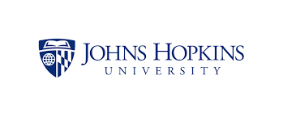

Data Science Specialization Capstone Project
========================================================
author: Created by Dimitrios Apostolopoulos
date: May 20th, 2015
autosize: true
transition: rotate
transition-speed: slow

This presentation is a brief description of a [Shiny](http://shiny.rstudio.com/) application that predicts the next word to the user's input. It was created as the final part of the Data Sciense Specialization provided by [JHU](https://www.jhu.edu/) and [Coursera](https://www.coursera.org/).

About the text corpus
========================================================
left: 70%

- The text corpus used for the creation of the algorithm is provided by [SwiftKey]("https://swiftkey.com/en") and can be downloaded from this [link](https://d396qusza40orc.cloudfront.net/dsscapstone/dataset/Coursera-SwiftKey.zip). It consists of three different text files containing data from blogs, twitter and news feeds, it is multilingual but for the purposes of our project only the english files were used.
- In order to achieve better performance for the algorithm, we didn't use the whole text corpus, we used random samples of 100000 rows from each text file. 

***

The Algorithm
========================================================

- Corpus creation
     - Unify the three different text files in one.
     - Cleanse the data (remove non ASCII characters, transform all letters to lowercase, remove urls, remove punctuation marks, strip whitespace, remove profanity words).
- Tokenize the corpus with tokens of length of four words, three words and two words.
- Create the frequency tables and the ngrams.
- The algorithm makes predictions according to the user's input. At first it tries to match a prediction in the 4-gram, it continues searching in the 3-gram and at the end in the 2-gram. If no prediction is produced it returns a proper message. 

The Application
========================================================

- The user types in the input box, then he hits the submit button. 
- On the output panel are printed the top three predictions and a bar chart with the frequensies of every prediction. 

Additional Information
========================================================

- The Predict the next word application is hosted on shinyapps.io: [https://dapostolopoylos.shinyapps.io/NextWord](https://dapostolopoylos.shinyapps.io/NextWord)
- This pitch deck is hosted on RPubs: [http://rpubs.com/dapostolopoylos/CapstoneProject](http://rpubs.com/dapostolopoylos/CapstoneProject)
- The code for the application and the pitch deck is hosted on GitHub: [https://github.com/dapostolopoylos/SwiftKeyCapstoneProject](https://github.com/dapostolopoylos/SwiftKeyCapstoneProject) 
